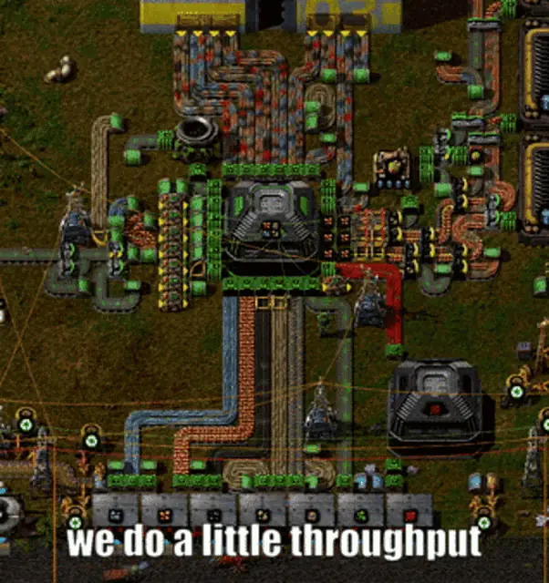

# 

> [!NOTE]   
> This is more of a silly, exploratory and for fun kind of project for me. We are doing things that PHP was never really designed for, but, *why* not? Mixed in with other concepts, like application architecture that just so happen to pique my interest for the time being.
> You can also somewhat view it as a big sink of dirty dishes.

*This is a draft for the PHUNK code style guide and is a W.I.P!*

[Overview](docs/GETTING_STARTED.md) | [Style](docs/STYLE.md) | [Modules](docs/MODULES.md) | [Architecture](docs/ARCHITECTURE.md) | [Migrating from DI](docs/MIGRATING_FROM_DI.md) | [Standard Library](docs/STDLIB.md)

# Introduction

The primary motivation for this coding style guide is to make it more practical to write and reason about large, complex, stateful application servers, which require low latency and high throughput.

For lack of a better term we will call it a procedural style, in which programs can be thought of as a series of conveyor belts where data is loaded at one end with various stations along the belt to manipulate it to the other end.

We use a loop that advances our program, each step able to process data in bulk, which serves well both for performance and for keeping a large amount of state manageable as the system grows.

## It's all about that data

A program is transforming data from one form into another. Any program can be thought of as a series of conveyor belts, where data is loaded on one end, moves through stages, one might transform it, another might move it to another belt on some condition, it ends up somewhere.

It might not always feel like that, though. In many codebases the abstractions, frameworks, and deep object graphs can hide the data flow.

What we can establish still is that if something is computable, it's ultimately a data transformation. Programs can be broadly categorized by the primary kind of data transformation they perform:

- Servers transform network requests into responses.
- Interactive apps transform state based on user input.
- Simulations and games transform state from input and clock ticks.
- Processing jobs transform arguments and file data into output.

That is essentially every program ever written, writing a correct one is mostly a matter of transforming its data correctly. Some of those transformations are trivial; others are very very complex, threading many steps and a great deal of state from input to output.

Thinking in terms of a conveyor belt where data moves in stages is helpful here. The explicit data flow keeps complex transformations more tractable: when correct input gives a wrong result, you bisect the belt to find the stage at fault. This works recursively, too, since if A, B, and C are right but D is wrong, you bisect D's substages the same way.

So a large idea of this style is that we want to make the data flow explicit, in contrast to some object-oriented styles, where its common for behavior to be more spread across objects calling other objects, method calling a method, or any other flow that has no easy single order to walk.

We want to think about programs more as a series of conveyor belts, and structure our programs in a way that better represents the data that is flowing through it.

*If you have played Factorio, it can be useful to think about your program as a factory:*

## Writing more efficient code

Some might think:

> If I really wanted my code to be fast I would use a faster language!

That is fair, and you will likely get better performance either way. But, writing performant code is more than just that; sure, some languages don't provide the necessary features, but PHP has a JIT, and it can turn a lot of your slow VM interpreted code into C code that gets compiled to machine code on the fly.

That is not to say PHP covers all the wants and needs for writing performant code, there are still some dearly missed primitives that I would love for it to have (one being byte buffer primitives to avoid string copying for simple comparisons or replacements).

In any case, when the JIT doing its job properly, the code execution itself is not actually that slow anymore (relatively speaking).

Sure, a systems level language with a sophisticated compiler is able to do a lot of work by optimizing away many slow code paths, patterns and other return shapes for you by doing extensive whole project analysis.

But, not all of them. Those are just one piece of the puzzle, perhaps the more important aspect lies in the difference of how a systems level language typically puts more focus on the memory model and how the CPU likes being fed properly.

> Once the JIT makes the code execution path fast, what is left to make the code faster?

### About PHP

*A digression on the origins of PHP.*

We must not forget that PHP was originally made as a simple templating language to make it easier to make dynamic websites.

Originally, PHP stood for Personal Home Page, and the person who made it was Rasmus Lerdorf, in 1994, released public in 1995.

As the project grew from a simple suite of personal utilities into a more fledged, general-purpose server-side scripting language, the community rebranded it to Hypertext Preprocessor.

Nowadays, PHP is being used for lots of different things and remains to be popular in use, but it is tapering off a bit for newer projects.

The thing that PHP was originally made for, which was its stateless in-flight HTTP request processing is still the primary way it is being used today.

And for that PHP is a pretty nice and pragmatic language.

> But is PHP good for anything else?

It could be. But its rather lacking and not a very attractive sell anymore.

Many remnants remain of the era, and some could be considered too lacking of making it really worthy as the choice of a general purpose language for an outsider.

... todo flesh out

PHP doesn't have any concept of modules, and its a lot to do with its history of being a templating language.

You simply include a file from wherever, whenever, and it handles it fine. This was very convenient when you wanted to render HTML templates, you could split them up into files and easily reuse or include them on other pages.

Now, the *evil* package managers have taken control! A classic story... todo flesh out. PSR-4 stuff and the consequence

... todo flesh out

The templating aspect while cool at the time is not very favored anymore due to the lack of context aware escaping mechanisms giving room for security issues to arise.

Most frameworks employ their own kind of hypertext preprocessing nowadays.

Really, PHP might be in quite a bit of an identity crisis you could say, without any clear vision of what it ought to be.

... todo flesh out

Typically you would send a request to an HTTP server that would manage a set of PHP processes which would spin up and down for every request: a request comes in and a new PHP world is built every time, then at the end of the request the world is destroyed, ad infinitum.

The model is still the primary one in use today, and you could argue that some aspects are nice such as the safety provided, it aids in preventing memory leaks, state bugs and crashing doesn't take the whole server down.

However, it is quite limited in many aspects. And for a language to be solely focused on that on its own is not very useful.

PHP rapidly gained popularity in the dot com bubble due to its ease of use and open nature. It was a great thing for newcomers or hobbyists, you simply plop down a .php file on a directory on a server, thats it. That is how you wrote your program, it was very easy to get started with.

But, it does have its limits too. Notably lacking in performance and streaming capabilities.

... todo V move that shit up or something to not be disconnect

There has not been put much focus on the memory model or performance aspect because you were typically limited by stateless request model anyways.

but we are reaching the limits as most of the time you would be limited by the request model itself.

... todo flesh out

If you already have some way to conceptualize memory access in your head and how it affects your performance, and done the work to make your code follow that direciton, and your code is still not fast enough, you might want an escape hatch to a better suited language, or consider the problem at hand.

For those who are so clever already; you will probably not find the stuff talked about here to be that interesting. Still, there might be some tricks used that you didn't think were possible in PHP, no guarantees or money back however.

Before the next section, lets ask ourselves: if we don't have a mental model for how memory access impacts performance, how do we know the code we write is optimal or fast at all?

### Mesure it

Measuring your program is the most crucial part. If you can see what takes up the most amount if time during execution you can more quickly can narrow down the scope of what is worth focusing on. That is the theory.

Typical tools used for narrowing down the problems include not not limited to:

- Profilers
- 
- Benchmarking software
- 

It is important to not be too naive here, as benchmarking can be hard. Profilers and measurement tools carry overhead of their own, some drastically reducing throughput and even skewing results in a different direction entirely(perturbation of JIT decisions and memory layout to name a few).

That is why it is wise to use a combination of these tools in order to acheive the best result.

Thankfully, many are made with this exact thing in mind, as what practical use would it have if not? Well, it all depends Lean towards a sampling profiler over instrumenting ones, these usually have a mucch lower impact on performance.

Common in many languages is something called a "flame graph". Basically, you can visualize your program and quickly see which parts take up most amount of the time, you read it by scanning for wide looking areas, or boxes, typically representing a function/method, identified by its name or more.

We won't be focusing much on how to measure here but instead put forth a hypothethical: you have measured your program and put effort into optimizing it; you can't see any obvious ways to improve further.

Measure it! But, even this can sometimes be a challange.

Picture this: 

Because, what might be perceived as fast, might be far from optimal simply due to a lack of feeding the CPU more of what it wants.

If your code was not made with this memory model in mind, it's not unlikely that it is far from optimal, and that you code could steel have a ton of room without switching the language.

Were you to write you code in the exact same way it is not unlikely it would be faster, but likely it would not be optimal at all less you already optimized it.