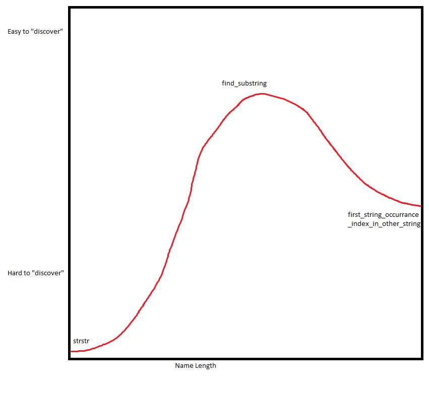

# Style is design 

We draw inspiration from the excellent [TigerStyle](https://github.com/tigerbeetle/tigerbeetle/blob/main/docs/TIGER_STYLE.md) where applicable to PHP. Much of the below stems from that.

## Syntax casing

snake_case namespaces are deliberately against the usual PascalCase to avoid the confusion with types.

> Note: *modifiers* (`#![local]`, `#![internal]`), not types. The `#!` prefix makes them comments.

Built-in and third-party that break this keep their source casing, we can't do much about that.

| Construct                     | Casing             | Example                    |
| ----------------------------- | ------------------ | ----------------           |
| Variable, local               | `snake_case`       | `$order_line`              |
| Variable, property            | `snake_case`       | `$created_at`              |
| Variable, parameter           | `snake_case`       | `int $row_count`           |
| Function, free                | `snake_case`       | `order_total()`            |
| Function, method              | `camelCase`        | `getTotal()`               |
| Type, record (struct)         | `PascalCase`       | `OrderLine`                |
| Type, class (object)          | `PascalCase`       | `HttpClient`               |
| Type, interface               | `PascalCase`       | `Comparable`               |
| Type, trait                   | `PascalCase`       | `Timestamps`               |
| Type, enum                    | `PascalCase`       | `OrderStatus`              |
| Type, enum case               | `PascalCase`       | `OrderStatus::InTransit`   |
| Namespace                     | `snake_case`       | `app\order_book`           |
| Array key, string             | `snake_case`       | `'order_line'`             |
| Constant                      | `UPPER_SNAKE_CASE` | `MAX_SIZE`                 |
| Goto label                    | `UPPER_SNAKE_CASE` | `PARSE_END`                |
| Attribute, modifier           | `snake_case`       | `#![internal]`             |
| Attribute, class              | `PascalCase`       | `#[Route]`                 |

Treat acronyms as words: first letter cased per the rule, the rest lowercase.

- `HttpClient`, not `HTTPClient`
- `parseXmlId()`, not `parseXMLID()`
- `$user_id`, not `$user_iD`

## Naming things

Prioritize naming and flow: if code reads naturally, comments are mostly for non-obvious constraints.

Avoid excessive abbreviations with exceptions being things like loop counters or a similar vein. Try using a concept per name, and avoid reusing a name for two concepts in one scope.

Try keeping related names at similar length and balance as they are easier to scan side by side. Append units by descending significance so related names group: `$latency_ms_max`, `$size_bytes_total`.

Longer names are be fine so long as they are doing their job by being explicit about what the thing is and or does. If used heavily it can be wise to think about its length as it could be derived from context.

Please refer to the very scientific graph below:



## Error handling

Expected failures are values and not exceptions. Reserve exceptions for the genuinely exceptional: failures with no meaningful local handling, like running out of memory or a missing required config at startup, where the only sane response is to crash fast. Always handle errors and never ignore a return.

Below is an example of using a union `T|ErrorEnum` for explicit error handling, you may also use the nullable return `?T` for more obvious errors.

```PHP
namespace app\ledger;

enum AccountError
{
    case NotFound;
    case Frozen;
    case InsufficientFunds;
}

function account_debit(
    Account $account,
    int     $amount_cents,
): Account|AccountError
{
    if ($account->frozen) {
        return AccountError::Frozen;
    }
    if ($account->balance_cents < $amount_cents) {
        return AccountError::InsufficientFunds;
    }

    $account->balance_cents -= $amount_cents;
    return $account;
}
```

```PHP
namespace app\api;

use app\ledger;
use app\http;

function account_debit_page(
    ledger\Account $account,
    int            $amount_cents,
): http\Response
{
    $result = ledger\account_debit($account, $amount_cents);
    if ($result instanceof ledger\Account) {
        return http\ok($result);
    }

    return match ($result) {
        ledger\AccountError::Frozen            => http\conflict('frozen'),
        ledger\AccountError::InsufficientFunds => http\payment_required(),
        ledger\AccountError::NotFound          => http\not_found(),
    };
}
```

You can back the enum when each case carries a fixed, stable payload, like a message to show. The value travels with the case, so you don't reach for a struct.

```PHP
namespace app\ledger;

enum AccountError: string
{
    case NotFound          = 'account_not_found';
    case Frozen            = 'account_frozen';
    case InsufficientFunds = 'insufficient_funds';
}
```

The caller still branches on the case; it just reads `->value` where it needs the wire form.

```PHP
$result = ledger\account_debit($account, $amount_cents);
if ($result instanceof ledger\Account) {
    return http\ok($result);
}

return http\error($result->value);
```

### Clean up at the edge

It's important that you think about what would happen if an exception were to occur at any moment. For examle, a resource opened must be released, even when a panic unwinds.

```PHP
$lock = lock\acquire($env->locks, $account_id);
try {
    return account_settle($account);
} finally {
    lock\release($lock);
}
```

Keep acquire and release adjacent so a leak is obvious.


### Assertions

Assert what must be true. A wrong belief should crash here, not corrupt data later. Aim for two per function. Check arguments, results, and what must never happen.

```PHP
namespace app\ledger;

function account_debit(Account $account, int $amount_cents): void
{
    assert($amount_cents > 0);
    assert(!$account->frozen);

    $account->balance_cents -= $amount_cents;

    assert($account->balance_cents >= 0); 
}
```

One assert per line, so you know which one fired.

```PHP
assert($a);
assert($b); 
// not: assert($a && $b);
```

Asserts are for bugs, never for input. 

For performance, assert freely where it's cheap, stay bare where it's hot like a loop over bulk data to keep branches out.

## Comments

Comments should explain why, not what; well-named identifiers say what already. Use comments for a hidden constraint, a non-obvious invariant, a workaround, or surprising behavior.

Prefer to use `//` comments for consistency and reserve `/** */` docblocks for types that PHP cannot represent in its own syntax or for quickly commenting out larger sections.

### Mark sections

For large files, it can be useful to mark your sections for navigation, these are easy to search for and can aid in navigating quicker.

```php
// Common for sections needing more work:

// TODO:
// FIXME:

// Single section marker for easier navigation:

// MARK: Helpers
```

When a section is long enough that folding it away helps, wrap it in `// region` / `// endregion`.

```php
// region Account import
// validate every row, then persist the whole batch in one transaction

function account_import(array $rows): int { /* ... */ }

#![local]
function account_import_validate_rows(array $rows): array { /* ... */ }
// endregion
```

## Clear is clever

Write the boring version. The reader should not have to decode. Simple is hard, not the first version you write. It is the last one, after you have understood the problem well enough to make it look easy. Take the time.

Always say why.

```PHP
// bad: hard to read
$b = $items[($h = crc32($k)) % $n];

// simple: just read it
$hash = crc32($k);
$slot = $hash % $n;
$b    = $items[$slot];
```


## Put a limit on everything

Every loop and queue has a max. Unbounded means one bad input takes the server down.

```PHP
use app\queue;

// bad: grows forever
while (queue\ring_buffer_pop($ring, $x)) {
    $batch[] = $x;
}

// good: drain at most a batch
$max = 1024;
for ($i = 0; $i < $max && queue\ring_buffer_pop($ring, $x); $i++) {
    $batch[] = $x;
}
```

## Push ifs up, fors down

The parent decides. The helpers do.

Branches and state live in the parent. Helpers take plain values and return plain values, no questions about who called them, no writing back.

```PHP
namespace app\ledger;

class Row
{
    public int $amount_cents = 0;
}

// parent: owns the branch and the state
/** @param list<Row> $rows */
function account_import(array $rows): int
{
    $valid = account_rows_valid($rows);
    if (!$valid) {
        return 0;
    }
    return account_rows_persist($rows);
}

// leaf: pure, decides nothing, just answers
/** @param list<Row> $rows */
function account_rows_valid(array $rows): bool
{
    foreach ($rows as $row) {
        if ($row->amount_cents < 0) {
            return false;
        }
    }
    return true;
}
```

Pure leaves test alone and read top to bottom.

## Be a never nester

Deep nesting hides the path. Return early, handle the bad case, get out. Each level should be the happy path going down, not a staircase.

```PHP
namespace app\ledger;

// bad: the real work is buried three levels deep
function account_debit(Account $account, int $amount_cents): bool
{
    if (!$account->frozen) {
        if ($amount_cents > 0) {
            if ($account->balance_cents >= $amount_cents) {
                $account->balance_cents -= $amount_cents;
                return true;
            }
        }
    }
    return false;
}

// good: guards out, work flat at the bottom
function account_debit(Account $account, int $amount_cents): bool
{
    if ($account->frozen) {
        return false;
    }
    if ($amount_cents <= 0) {
        return false;
    }
    if ($account->balance_cents < $amount_cents) {
        return false;
    }

    $account->balance_cents -= $amount_cents;
    return true;
}
```

### Split long procedures into steps

Extracting into helpers reads more like prose. When a procedure grows long, ask if it's doing one thing or several. Often it's several, so pull those out and let the parent read as a table of contents.

```PHP
namespace app\ledger;

// the parent reads like a table of contents
function account_import(array $rows): int
{
    $clean = account_import_rows_clean($rows);
    $valid = account_import_rows_valid($clean);
    return account_import_rows_persist($valid);
}

// TIP: A helper that exists only for account_import keeps the parent name as a
// prefix and is marked #![local].
#![local]
function account_import_rows_valid(array $rows): array
{
    return $rows;
}
```

## State invariants positively

Say what should be true, not what shouldn't. A positive test reads straight and the boundary is obvious.

```PHP
// harder: a negation, and the boundary is fuzzy
if (!($index >= $count)) { ... }

// clear: the thing that must hold
if ($index < $count) { ... }
```

## Long signatures

One line while it fits the 100 columns. When it doesn't, one parameter per line, names aligned into a column, a trailing comma, and the return type on the closing line.

```PHP
// fits: keep it on one line
function account_debit(Account $account, int $amount_cents): Account|AccountError
{
    // ...
}

// too long: one per line, types and names as two aligned columns
function transfer_handle(
    env\Env          $env,
    transfer\Request $request,
    transfer\Options $options,
): transfer\Result
{
    // ...
}
```

## Pass options explicitly

Spell out the options that matter at the call site, if the defaults change under you it wont be a silent bug.

```PHP
use app\ledger;

// hidden: the defaults decide; change one and every caller shifts silently
$rows = ledger\account_search($query);

// explicit: the call states what it wants
$rows = ledger\account_search($query, limit: 50, include_closed: false);
```

## Batch work and let the CPU sprint

The CPU loves bulk processing best. Big straight runs are much faster than ping ponging between tasks, so amortize it: gather, process, commit in bulk.

```PHP
use app\store;

// bad: a round-trip per row
foreach ($orders as $order) {
    store\order_save($db, $order);
}

// good: one sweep, one round-trip
store\order_save_many($db, $orders);
```

Lay data out so a pass reads it in order, then sweep it once. Cache-efficient chunking comes first.

## Run at your own pace

Don't react to each external event the moment it lands. Take it onto a queue and work it on your own loop. A steady tick is predictable; an event storm can't knock you over.

Owning the loop buys a lot:

A tick holds many items at once, so you batch. One query, one flush, Batching is efficient and cache friendly: the same work over a packed run of data, read in order. The CPU loves that style most of all.

You can also coalesce while you are there, collapsing ten "dirty" events into one redraw before doing any work.

The queue smooths the world. A bounded queue gives you backpressure, so under load you shed or reject instead of falling over, and bursts flatten into a steady rate with predictable latency.

And the statistics practically fall out from it: queue depth is load, items per tick is throughput, time per tick is latency.

```PHP
namespace app\worker;

use app\queue;

// bad: handle each event inline, at the sender's pace
function on_message(Message $message): void
{
    message_process($message);   // a burst floods you
}

// good: enqueue now, drain on the tick, bounded
function on_message(queue\RingBuffer $inbox, Message $message): void
{
    queue\ring_buffer_push($inbox, $message);
}

function tick(queue\RingBuffer $inbox): void
{
    $max = 1024;
    for ($i = 0; $i < $max && queue\ring_buffer_pop($inbox, $message); $i++) {
        message_process($message);
    }
}
```

## One source of truth

> Give a man a state and he'll have a bug one day, but teach him to represent state in two separate locations that have to be kept in sync and he'll have bugs for a lifetime.

Never duplicate a variable to remember a value: two sources of truth diverge. Compute or pass it, close to where it is used. Consolidate mutation: the fewer points that can write a value, the easier it is to reason about.

## No magic

Code should do what it says. No hidden dispatch, thats just not readable and impossible to make performant.

```PHP
// bad: __call parses the method name into a query; the columns aren't greppable
$user = $users->findByEmailAndStatus($email, Status::Active);

// good: a real function you can jump to and grep
$user = store\user_find($db, email: $email, status: Status::Active);
```

## Money as integer

For those who still don't get it, TAKE NOTE. Represent money as integer minor units (cents), never a float. Floats round and drift; `0.1 + 0.2` is not `0.3`.

You can image a float as two dials that together give an estimate of a number: reserve floats for measurements that don't need to be 100% accurate.

Here are pretty visuals and story telling about [fundamental types in C](https://www.youtube.com/watch?v=GTNFrLZ5P1A) that gets that point across.

## Off-by-one

Index, count, and size are distinct:

| Concept | Meaning              | Conversion                          |
|---------|----------------------|-------------------------------------|
| Index   | Zero-based offset    | index + 1 = count for a single item |
| Count   | Number of items      | count * unit_bytes = size_bytes     |
| Size    | Byte or unit measure |                                     |

## Few dependencies

Every dependency is code you did not write running in your process: supply-chain risk, version churn, and surface you cannot see.

Prefer the standard library and a few lines of your own over a package. Add one only when it clearly earns its keep, and keep it behind your own edge so you can swap it.

## Other misc stuff, idk

- Line length 100 columns recommended; exceed only when breaking hurts more.
- Opening brace on its own line for classes, methods, functions; same line for control structures. Braces always.
- One blank line after the namespace and after the `use` block, and between functions.
- Trailing commas in multi-line arrays and argument lists.
